

  

  ✨*수많은 다른 세계*✨를 만날 수 있는 곳, **와툰** :stars:

* * *

# 🧚‍♀️와툰을 소개합니다!
아마추어부터 프로까지, 모든 창작자들의 낙원! 와툰 👼

와툰 [다운로드]

* * *

## 💻 Contributors

|김하늘|남기태|이수인|이현오|장하경|정시훈|최유찬|
|:----:|:----:|:----:|:----:|:----:|:----:|:----:|
||||||||
|프론트엔드|프론트엔드|백엔드|백엔드|백엔드|백엔드|백엔드|
|[kimhaneal11](https://github.com/kimhaneal11)|[kevin990222](https://github.com/kevin990222)|[silee1103](https://github.com/silee1103)|[hyunoh604](https://github.com/hyunoh604)|[paul-4722](https://github.com/paul-4722)|[20222-sh](https://github.com/20222-sh)|[gs20118](https://github.com/gs20118)|

## 🗃️ 사용스펙

#### 프론트엔드
    

#### 백엔드
     
    

* * *

## 📽️ 프로젝트 뷰
#### 1. 회원가입 페이지
    이메일주소, 비밀번호, 닉네임 입력 후 메일로 이메일 인증을 완료하면 회원가입이 완료됩니다.

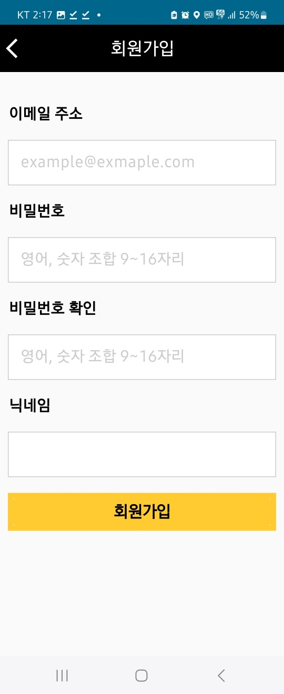

#### 2. 로그인 페이지

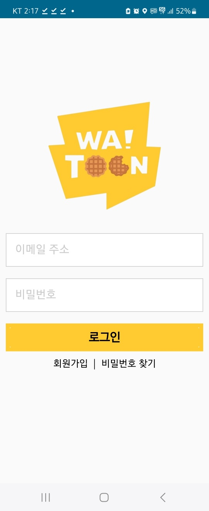

#### 2-1. 비밀번호 찾기 페이지
이메일을 통해 비밀번호를 재설정할 수 있습니다.

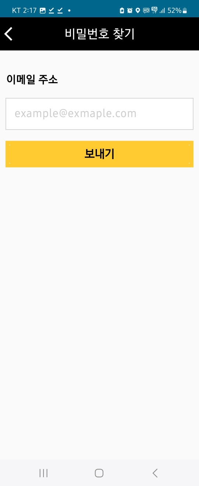

#### 3. 요일별 웹툰 페이지
요일별 웹툰 목록을 볼 수 있습니다.

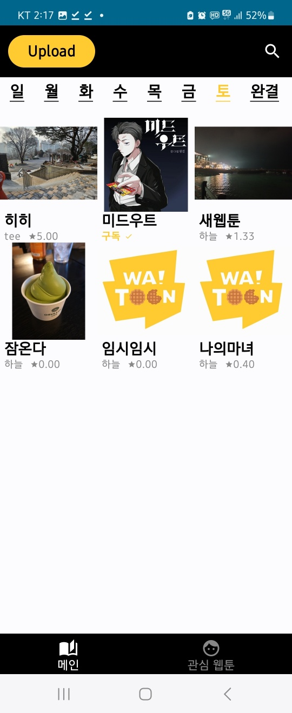

#### 4. 웹툰 상세 페이지
웹툰의 제목, 작가, 연재일, 설명, 태그, 회차 목록을 볼 수 있습니다.

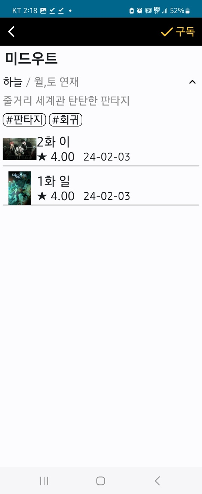

#### 5. 에피소드 감상 페이지
에피소드를 감상할 수 있습니다!

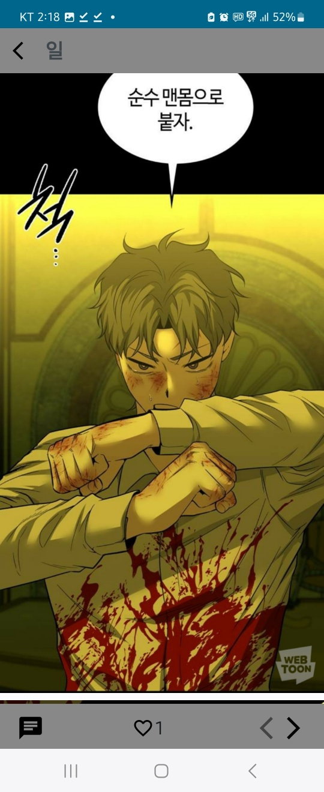

#### 5-1. 댓글 페이지

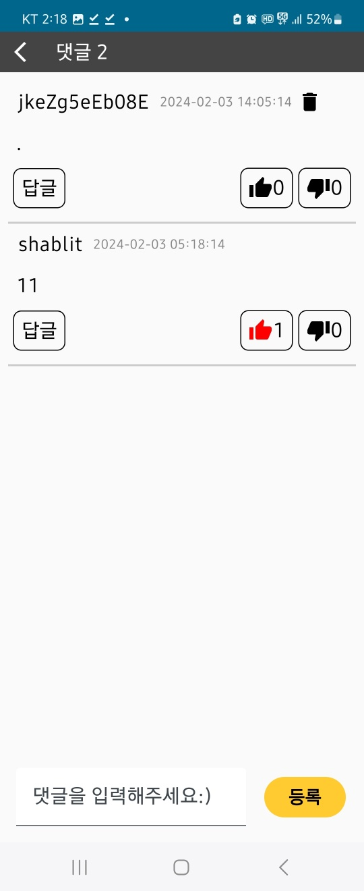

#### 5-2. 대댓글 페이지

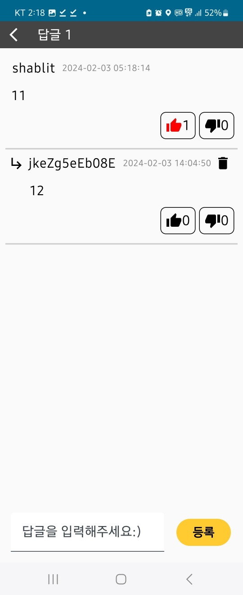

#### 6. 마이 페이지
관심웹툰 리스트를 확인할 수 있습니다.

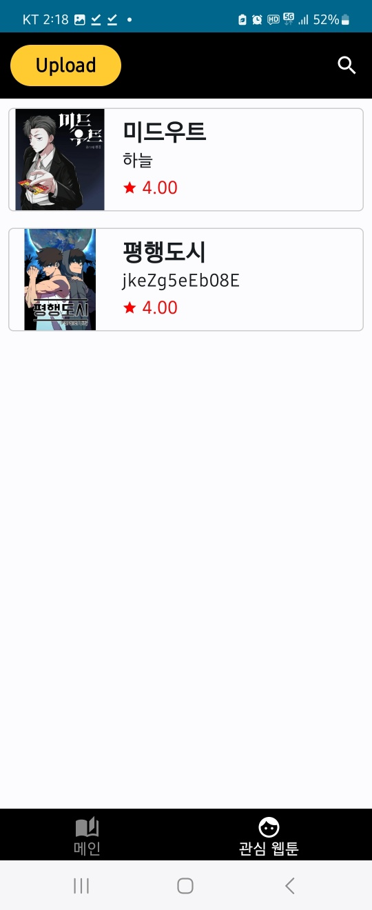

#### 7. 작가 페이지
내가 올린 웹툰 리스트를 확인할 수 있습니다.

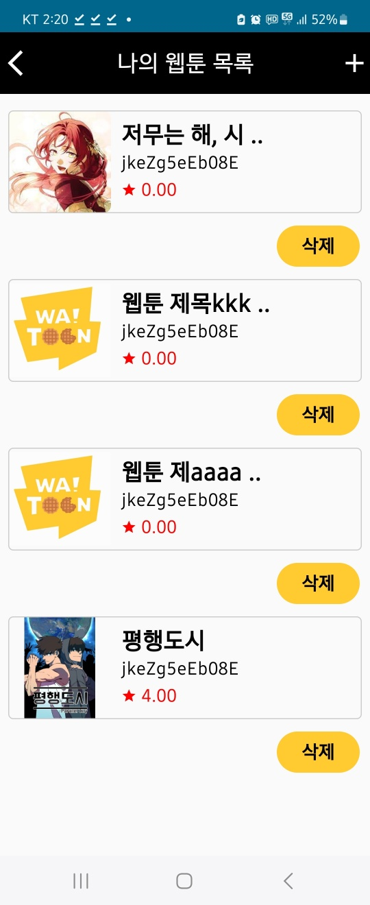

#### 7-1. 새 웹툰 생성 페이지
새 웹툰을 생성할 수 있습니다.

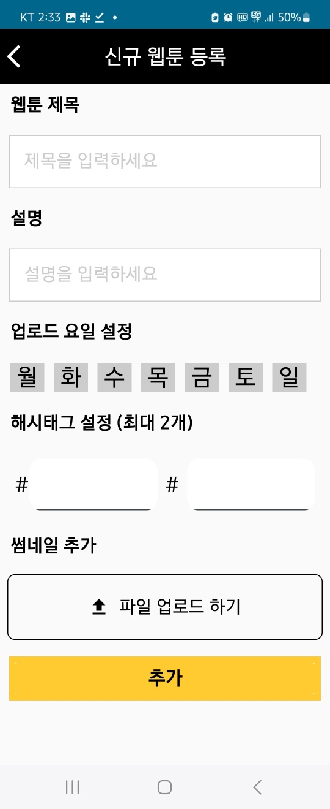

#### 7-2. 새 에피소드 생성 페이지
새 에피소드를 생성할 수 있습니다.

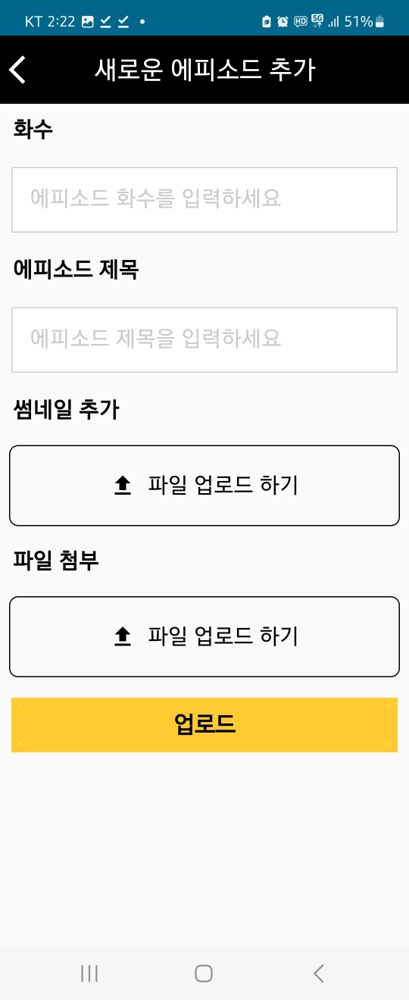

#### 8. 검색 페이지

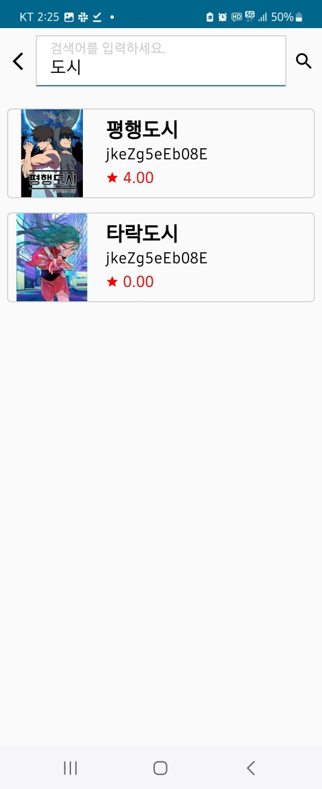

* * *

## :link: Urls
아래 swagger에 endpoint 목록이 나와있습니다.

[Swagger](http://watoon-env1.eba-ytauqqvt.ap-northeast-2.elasticbeanstalk.com/swagger/)

* * *

## 👷 컨벤션
- pr 스스로 merge 금지
- commit은 가능한 한 자세히 기입

## 💳 라이센스
This project is licensed under the terms of the MIT license. See LICENSE for more information.

## 🐈‍⬛ Reference
This app is copy project of already existing app, [Naver Webtoon].

[Naver Webtoon]: https://play.google.com/store/apps/details?id=com.nhn.android.webtoon&pcampaignid=web_share
[다운로드]: #TODO
